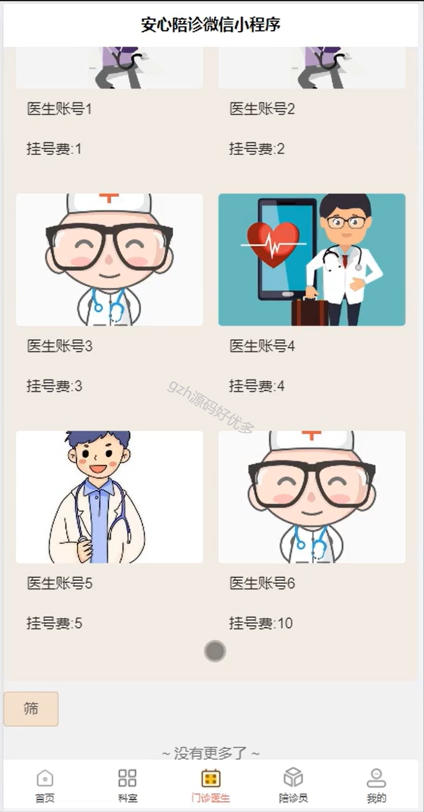
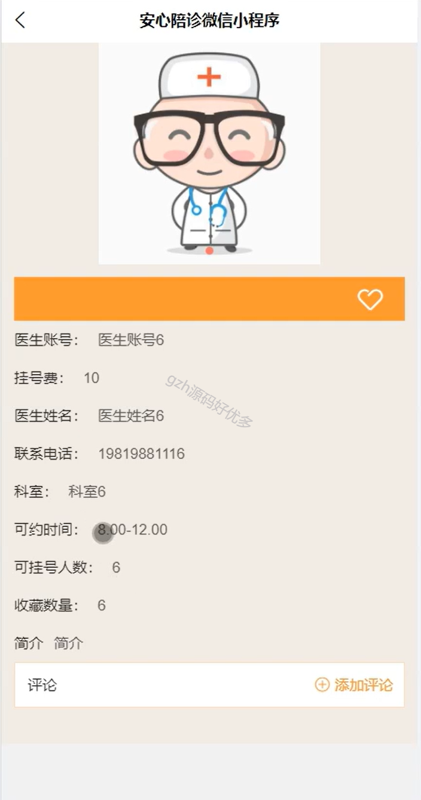
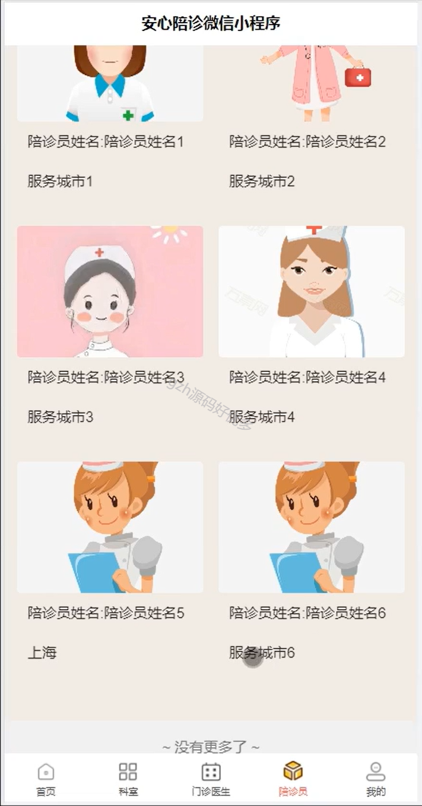
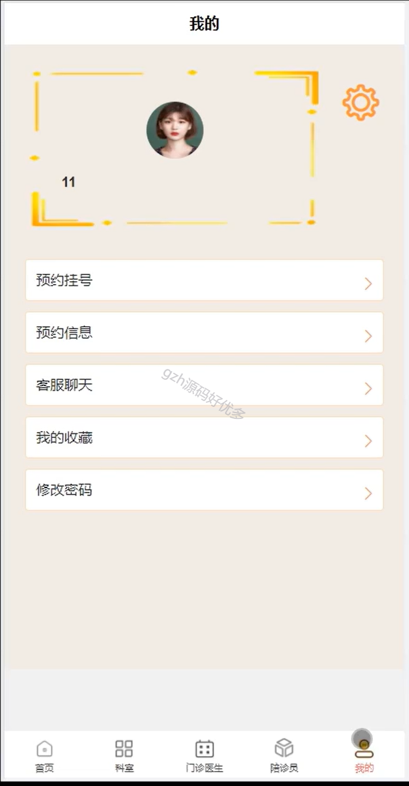
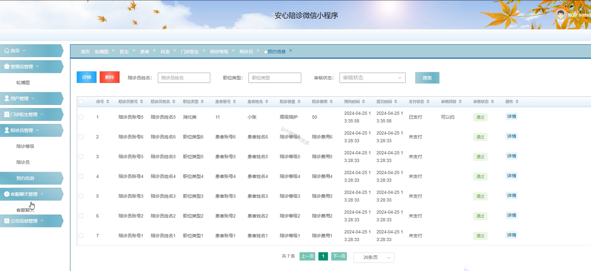
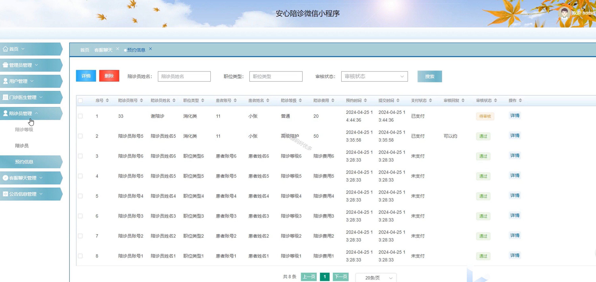

# mpweixinA074
mpweixinA074安心陪诊微信小程序（Vue3+原生+unipp）安心陪诊微信小程序（Vue3+原生+u 
## 查看主页获取源码

### 一、作品包含

源码+数据库+全套环境和工具资源+部署教程

### 二、项目技术

前端技术：Html、Css、Js、Vue3.0、Element-ui、Uniapp

数据库：MySQL

后端技术：Java、Spring Boot、MyBatis

  

### 三、运行环境

开发工具：IDEA/eclipse + HBuilderX + 微信开发者工具

数据库：MySQL5.7（最低要5.7版本）

数据库管理工具：Navicat10以上版本

环境配置软件： JDK1.8+Maven3.6.3

前端Nodejs：16

### 四、项目介绍
项目编号：mpweixinA074

安心陪诊微信小程序的作用是为有就医需求的用户提供包括陪诊服务预约、医疗信息咨询、就医流程协助、诊后关怀等在内的全流程、个性化陪诊服务，帮助用户尤其是老人、儿童、孕妇及行动不便者等更便捷、安心地就医。

该安心陪诊微信小程序系统面向用户、陪诊员、医生及管理员，功能如下

用户端
科室查询：首页展示不同科室，可点击查看更多，便于了解科室信息。
医生选择与挂号：呈现医生账号、挂号费、姓名、联系电话、可约时间、可挂号人数等信息，支持查看简介和评论，方便用户选择并预约挂号。
陪诊员预约：展示陪诊员姓名和服务城市，用户可据此选择合适的陪诊员。
个人中心：提供预约挂号、预约信息查看、与客服聊天、查看收藏内容、修改密码等功能，方便管理个人就医相关事务。

管理端
用户管理：对用户相关信息进行管理。
门诊医生管理：管理医生账号等信息。
陪诊员管理：包括陪诊等级设置、陪诊员信息管理，审核陪诊员预约信息，如查看陪诊员账号、姓名、职位类型、患者信息、陪诊等级、费用、预约时间、支付状态等，并进行审核回复操作。
客服聊天管理：管理客服聊天相关事务。
公告信息管理：发布和管理系统相关公告。

### 五、运行截图

  
